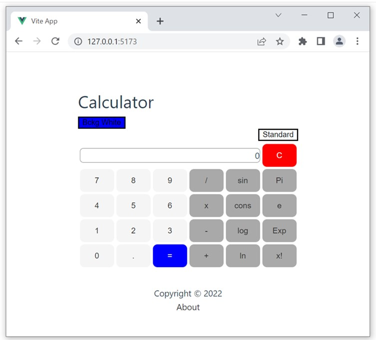

# This is Calculator Vue app

Standard Calculator
 

Scientific Calculator
 

## Project Setup

```sh
npm install
```

### Compile and Hot-Reload for Development

```sh
npm run dev
```

### Compile and Minify for Production

```sh
npm run build
```